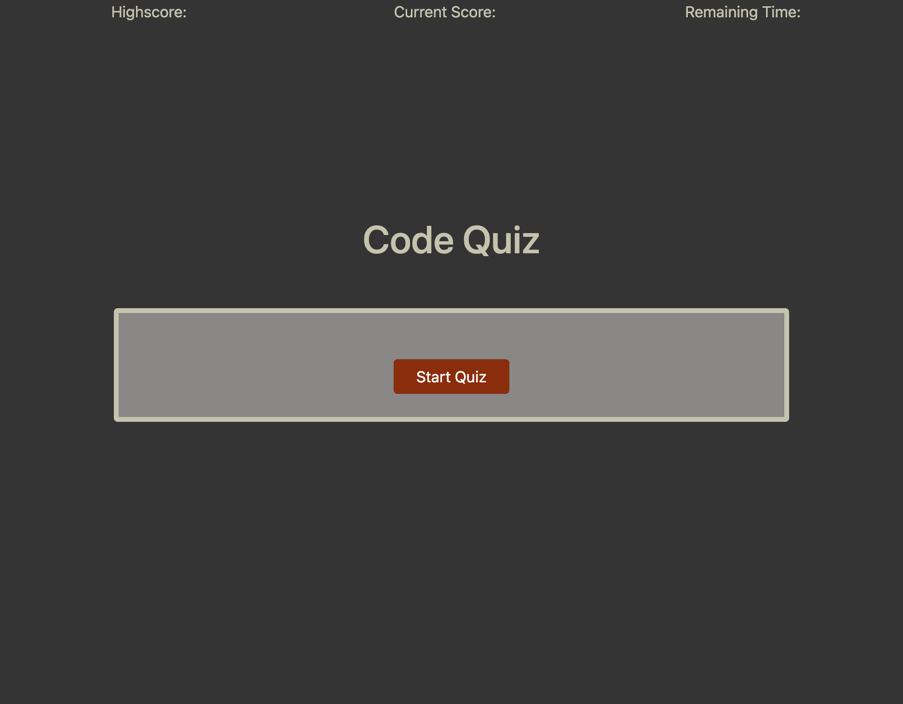

# code-quiz

## What is the project?

This project is a multiple choice quiz on programming. It involves HTML, CSS, and JavaScript. The user is presented with 4 questions, each containing 4 options with 1 correct answer.

## What were the challenges?

This website was challenging with being able to save the high score, the current score and with being able to manipulate the DOM through JavaScript.

## What was updated?

This project was created from scratch so nothing was updated.

## Why did I decide to do this project?

I want to help others who may be interested in getting into web development. Hopefully through this quiz, they will get intrigued and want to learn more afterwards.

## What I learned in the process?

I learned so much more about JavaScript logic, commands, DOM manipulation. I was also able to refresh my knowledge of some basic CSS.

## What makes this project stand out?

This project is a great example of a multiple choice, timed quiz that keeps highscores on the local storage.

## Project Screenshot  

 
## Link to Deployed Project  

https://stevenstefanov.github.io/code-quiz/

## Instalation

No installation required for this application.

## Usage

Click on the Start Quiz button, read the questions and select the correct answer on each questions. At the end of the quiz, type in your name or initials and play again.

## Credits

Thank you to Columbia's Full-Stack Web Developer bootcamp for all the assistance and for teaching me all that I have learned. Credit also goes to Google for helping me find any needed resource.

## Licence

Copyright (c) 2021 Steven Stefanov

Permission is hereby granted, free of charge, to any person obtaining a copy
of this software and associated documentation files (the "Software"), to deal
in the Software without restriction, including without limitation the rights
to use, copy, modify, merge, publish, distribute, sublicense, and/or sell
copies of the Software, and to permit persons to whom the Software is
furnished to do so, subject to the following conditions:

The above copyright notice and this permission notice shall be included in all
copies or substantial portions of the Software.

THE SOFTWARE IS PROVIDED "AS IS", WITHOUT WARRANTY OF ANY KIND, EXPRESS OR
IMPLIED, INCLUDING BUT NOT LIMITED TO THE WARRANTIES OF MERCHANTABILITY,
FITNESS FOR A PARTICULAR PURPOSE AND NONINFRINGEMENT. IN NO EVENT SHALL THE
AUTHORS OR COPYRIGHT HOLDERS BE LIABLE FOR ANY CLAIM, DAMAGES OR OTHER
LIABILITY, WHETHER IN AN ACTION OF CONTRACT, TORT OR OTHERWISE, ARISING FROM,
OUT OF OR IN CONNECTION WITH THE SOFTWARE OR THE USE OR OTHER DEALINGS IN THE
SOFTWARE.
